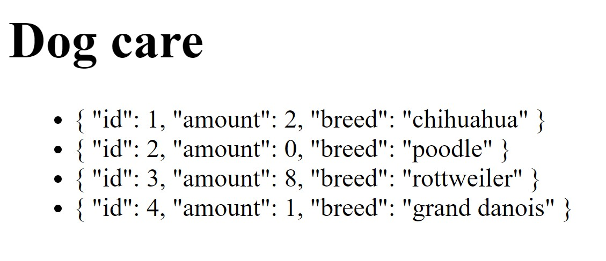

# Doggy-Day-Care

### This is an example of how you can play around in Vue.js with an API.

This is a link to an API filled with [dogs](https://api.jsonbin.io/b/5f33ff6c1823333f8f226715 "Dog API").

### Initialize the Vue instance with some room for the doggies!
<code>
const app = new Vue({
        el: '#app',
        data: {
            dog: 'Chihuahua'
        }
    })
</code>

### Once you have created your Vue instance, let's make use of it in your HTML
<code>
        <html lang="en">
        <head>
            <meta charset="UTF-8">

            <title>Document</title>
        </head>
        <body>
            

                <h1>Dog care</h1>
                {{dog}} is here
            

        </body>
        </html>
</code>

### Don't forget to include the CDN 
<code>
        
</code> 

### Let's add some more dogs to the party!

<code>
        const app = new Vue({
                el: '#app',
                data: {
                    dogs: ['chihuahua',
                        'poodle',
                        'rottweiler'
                    ]
                }
        })
</code>

### To be able to iterate over our list of dogs, we got to make use of Vue's "v-for"

<code>
        
        <li v-for="dog in dogs">
            {{dog}}
        </li>
        
 </code>

### Instead of hard code a list of dogs, why not fetch them from our API?

<code>
        
        const app = new Vue({
        el: '#app',
        data: {
            dogs: []
        },
        created () {
            fetch('https://api.jsonbin.io/b/5f33ff6c1823333f8f226715')
            .then(response => response.json())
            .then(json => {
                this.dogs = json.dogs      // this.dogs = the dogs in your data of your current instance
            })
        }
    })</code>
    
The created hook allows you to add code which is run if the Vue instance is created. Created is a step in Vue's lifecycle.

### That didn't look that very pretty
#### Let's change that
<code>
        <li v-for="dog in dogs">
            {{ dog.amount }} {{dog.breed}}
        </li></code>
        
        
### 
